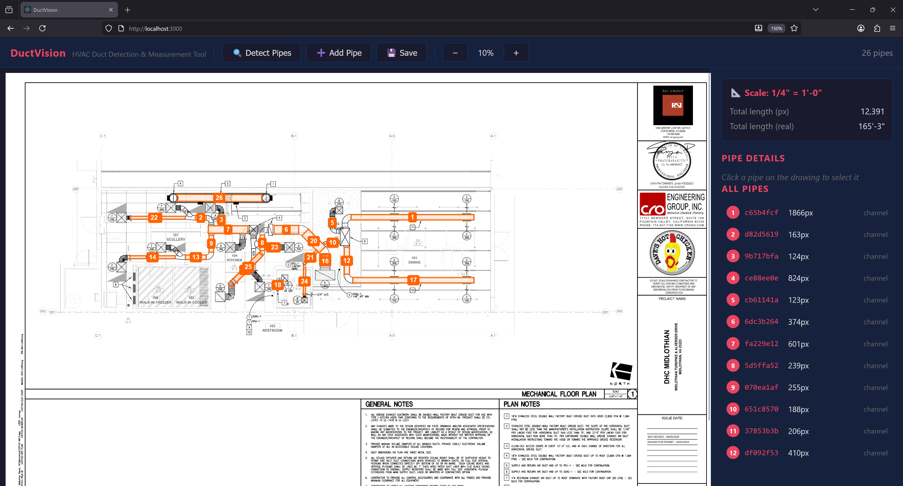

# DuctVision

HVAC Duct Detection & Measurement Tool — automatically detects rectangular ducts/pipes in mechanical engineering drawings (PDF), measures their lengths, and provides a web-based viewer for review and editing.



> **Note:** To add your own screenshot, take a screenshot of the app and save it as `docs/screenshot.png`.

## Features

- **Automatic duct detection** from PDF mechanical drawings using multi-layer computer vision (white channel analysis, diagonal pipe detection, Hough line pairs, black contour rectangles)
- **Scale extraction** via OCR — reads scale notations like `1/4" = 1'-0"` from the title block
- **Real-world measurements** — converts pixel lengths to feet-inches using the extracted scale
- **Interactive web viewer** — pan, zoom (mouse wheel toward cursor), click to select pipes
- **Drag & drop pipes** — click and drag any pipe rectangle to reposition it on the canvas
- **Corner resize handles** — drag the 4 corner handles of a selected pipe to reshape/resize it
- **Edit pipes** — adjust centerline coordinates, width, length (with Update button), and angle from the sidebar
- **Add pipes** — draw mode with live rectangle preview (click start, drag to see preview, click to finish)
- **Delete pipes** with confirmation toast
- **Toast notifications** — visual feedback on save, delete, and create actions
- **Live summary** — total pipe length updates automatically on every change
- **Save/load** pipe data as JSON

## Tech Stack

- **Backend**: Python 3.12, FastAPI, OpenCV, NumPy, Tesseract OCR, PyMuPDF
- **Frontend**: React, TypeScript, HTML5 Canvas
- **Package manager**: uv (Python), npm (frontend)

## Prerequisites

- Python 3.12+
- [uv](https://docs.astral.sh/uv/getting-started/installation/) package manager
- Node.js 18+ and npm
- [Tesseract OCR](https://github.com/tesseract-ocr/tesseract) installed and on PATH

## Quick Start

### Using the batch file (Windows)

```
run.bat
```

This starts both the backend (port 8000) and frontend (port 3000).

### Manual setup

1. Install Python dependencies:

```bash
uv sync
```

2. Install frontend dependencies:

```bash
cd frontend
npm install
```

3. Place your PDF in the `input/` folder (default: `input/testset2.pdf`).

4. Start the backend:

```bash
uv run uvicorn api:app --reload --port 8000
```

5. Start the frontend:

```bash
cd frontend
npm start
```

6. Open http://localhost:3000 and click **Detect Pipes**.

### Using Docker

```bash
docker-compose up --build
```

Open http://localhost:8000 — the frontend is served from the backend in production mode.

## Usage

For a detailed walkthrough of every feature, see the **[User Guide](docs/user-guide.md)**.

Quick overview:

1. **Detect** — Click "🔍 Detect Pipes" to run automatic detection on the loaded PDF
2. **Select** — Click any pipe rectangle on the canvas to select it (highlights red, shows details in sidebar)
3. **Move** — Click and drag a pipe to reposition it
4. **Resize** — Select a pipe, then drag any of the 4 corner handles to reshape it
5. **Add** — Click "➕ Add Pipe", click a start point, drag to see the live preview, click again to place
6. **Edit** — Use the sidebar to adjust coordinates, width, angle, or type a new length and click "Update"
7. **Delete** — Select a pipe and click "🗑️ Delete Pipe"
8. **Zoom** — Mouse wheel zooms toward cursor position; toolbar +/− buttons zoom toward center
9. **Save** — Click "💾 Save" to persist all changes to disk

## Project Structure

```
├── api.py                 # FastAPI backend (REST endpoints)
├── pipe_marker.py         # Core duct detection engine
├── scale_extractor.py     # Drawing scale OCR & parsing
├── ocr_engine.py          # Tesseract OCR wrapper
├── pdf_renderer.py        # PDF to image rendering
├── models.py              # Data models
├── main.py                # CLI entry point
├── frontend/              # React TypeScript UI
│   ├── src/App.tsx        # Main viewer component
│   ├── src/App.css        # Styles
│   ├── src/api.ts         # API client
│   └── src/types.ts       # TypeScript interfaces
├── input/                 # Input PDF files
├── output/                # Detection results (JSON)
├── docs/                  # Documentation assets (screenshots)
├── run.bat                # Windows launcher
├── Dockerfile             # Multi-stage container build
└── docker-compose.yml     # Container orchestration
```

## API Endpoints

| Method | Endpoint | Description |
|--------|----------|-------------|
| POST | `/api/detect` | Run duct detection on PDF |
| GET | `/api/page-image` | Get PDF page as JPEG |
| GET | `/api/pipes` | List all detected pipes |
| PUT | `/api/pipes/{id}` | Update pipe coordinates/width |
| POST | `/api/pipes` | Create new pipe |
| DELETE | `/api/pipes/{id}` | Delete a pipe |
| POST | `/api/save` | Save pipe data to disk |
| GET | `/api/scale` | Get extracted drawing scale |
| GET | `/api/summary` | Get total pipe length summary |

## License

Private — all rights reserved.
